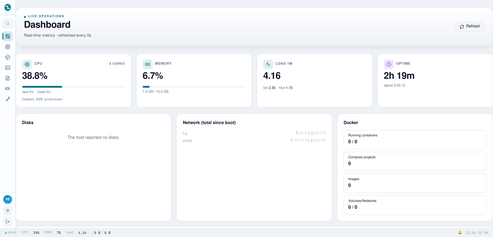
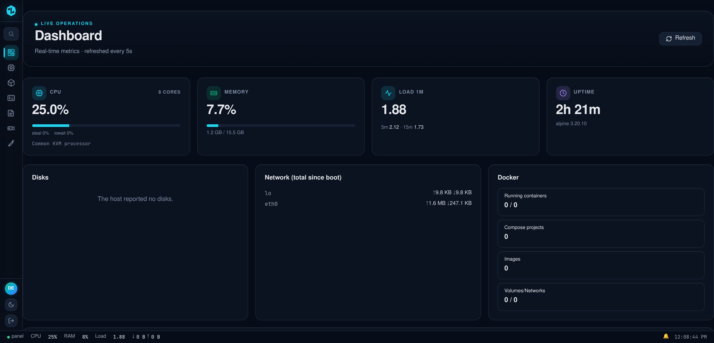
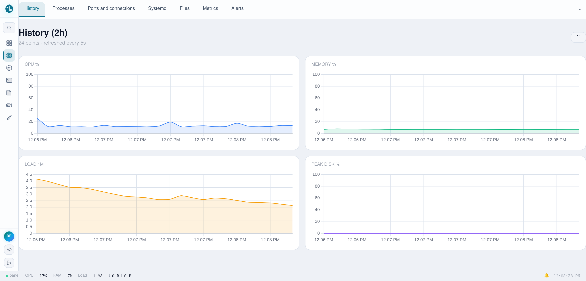
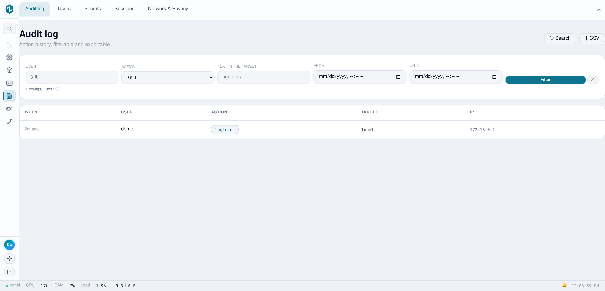
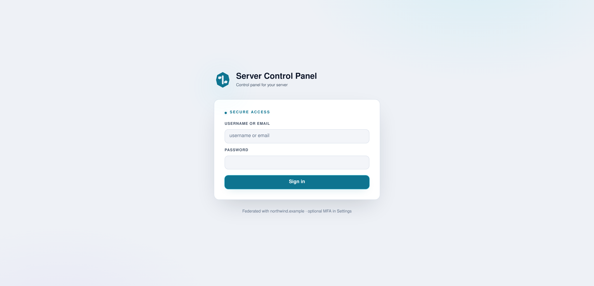

# server-control-panel

[](https://github.com/eranoix/server-control-panel/actions/workflows/ci.yml) [](LICENSE)   

**A web and phone dashboard to look after a Linux server without living in the terminal.**

*In plain words:* Looking after a server usually means typing commands into a plain text window, one at a time. This project puts all of that on one web page and in a phone app instead. From there you can see what is running, open and edit files, restart programs and schedule jobs, without memorizing commands. It is for anyone who keeps a server running, for a small team or for themselves. A demo version starts with a single command, so you can click around without a real server.

A single Go binary that replaces SSH, a terminal multiplexer, `docker`, `crontab`,
`journalctl` and a folder of shell scripts with one web page, plus a native
Android client that speaks the same API.

<p align="center"> </p>

## Try the demo

All you need is Docker with the Compose plugin (`docker compose version` should
answer). Go and the build run inside the image, so nothing else is installed on
your machine. From a clone of this repository:

```bash
docker compose up
# then open http://localhost:8765 and sign in with  demo / demo
```

The first run compiles the binary inside the image, which takes a few minutes.
If port 8765 is already taken, the same demo runs on 18767 with
`docker compose -f docker-compose.yml -f test/port-override.yml up`
(Compose 2.24 or newer). Stop it with Ctrl+C, or `docker compose down`.

The demo is read-only on purpose: writes, terminals and shell access are
refused, and it resets itself on every restart. Its inventory is made up, while
CPU and memory are read live from the demo container. A few panels are empty in
there by design: there is no Docker socket to read and no real disk to list, and
each of those panels says so instead of failing.

<picture><source media="(prefers-color-scheme: dark)" srcset="docs/screenshots/02-history-dark.png"></picture>

<picture><source media="(prefers-color-scheme: dark)" srcset="docs/screenshots/03-audit-log-dark.png"></picture>

<picture><source media="(prefers-color-scheme: dark)" srcset="docs/screenshots/04-login-dark.png"></picture>

---

## Why this exists

Administering a server means keeping a dozen tools in your head and a terminal
open on every one of them. This collapses that into one page and, more to the
point, into one artifact: a static binary with the entire front end compiled
into it. Deployment is copying a file.

The interesting parts are not the panels. They are the decisions underneath.

## Four decisions worth reading the code for

**Terminal sessions outlive the process that serves them.**
A PTY is allocated per session and attached to a detached multiplexer, so
restarting the control plane does not kill a running job. Reattaching replays
the live screen instead of starting a blank one. Rendering is *per client*: two
viewers of the same session at different window sizes each get output composed
for their own viewport, rather than the session collapsing to the smallest
connected screen.
→ `internal/pty/`

**Every subsystem fails soft, on purpose.**
Containers, hypervisor inventory, messaging, video, speech: each is opened
lazily and degrades to a disabled panel when its dependency is absent. A missing
dependency logs one line; it never stops the process from starting. A control
plane that refuses to boot because a monitored service is down is useless
exactly when you need it, since that is when you open it.
→ `internal/api/api.go`

**The public demo denies by default, at one choke point.**
`DEMO_MODE` installs a single wrapper in `Router.ServeHTTP` and refuses
everything except an explicit allowlist. Three independent rules: method
(GET/HEAD plus login), WebSocket upgrade (checked by header, so it holds on any
path), and path family. More than 250 routes are registered; with a denylist,
the next one added would arrive unguarded.
→ `internal/api/demo_mode.go`

**There is a way back in when the panel will not start.**
`panelctl` administers the same data directory with no web UI: reset
credentials, inspect state, rotate secrets. The failure it exists for is the one
where a web-only administration story leaves you locked out of your own machine.
→ `cmd/panelctl/`

## What is in the repository

| | |
|---|---|
| `cmd/server` | The control plane: HTTP API, web UI and the mobile back end in one binary |
| `cmd/panelctl` | Local admin and recovery CLI, works when the web UI does not |
| `cmd/node-agent` | Small agent for other machines, serving a closed list of named operations behind a per-node token |
| `cmd/wad` | WhatsApp daemon used by the messaging panel |
| `cmd/mobile-openapi-gen`, `cmd/sdui-contract`, `cmd/sdui-compat` | Generators and checks for the contract between server and app |
| `android/` | The Android client |
| `demo/`, `Dockerfile`, `docker-compose.yml` | The read-only demo |

## Stack

| | |
|---|---|
| Backend | Go 1.25, standard-library `net/http`; the one framework is huma v2, and only for the mobile back end's OpenAPI surface |
| Front end | Alpine.js, xterm.js, Monaco, Chart.js, no build step for app code |
| Storage | JSON files + SQLite (pure-Go driver, so `CGO_ENABLED=0` holds) |
| Auth | JWT in an HttpOnly cookie, WebAuthn passkeys, optional TOTP |
| Mobile | Kotlin + Compose, 17-module Gradle build |
| Image | Static binary on Alpine; the front end ships inside it via `go:embed` |

### Languages

A control plane is not one program, so the repository mixes several. GitHub's
count only makes sense after `.gitattributes` corrects its heuristics: the front
end lives under a directory called `vendor/` (that is where the asset server
reads from) and would otherwise be discarded as third-party code.

| | |
|---|---|
| Go | The control plane, almost all of it bare `net/http` |
| Kotlin | Android client: Compose UI and a VT terminal engine |
| JavaScript | Panel front end, plus browser tests driven over CDP |
| HTML | `index.html` is the panel: one Alpine template, not a shell |
| Shell | Build, release and test harnesses |
| Gradle (Kotlin DSL) | Multi-module build with a convention plugin |
| C++ | JNI bridge from Kotlin to `libghostty-vt` |
| Python | Doc-structure check and a VT session replayer |

Third-party code shipped in-tree (Monaco, xterm.js, mermaid, zstd, HDiffPatch)
is marked vendored and left out of that count, and so is `tailwind.css`, which
is build output.

## Android client

`android/` is a standalone Gradle build with its own terminal engine: a VT
parser driving a Compose renderer, rather than a web view around the same page.
The package is `dev.servercontrolpanel` and the application id is
`tech.northwind.servercontrolpanel`.

You need JDK 17, the Android SDK (platform 37 and build-tools) and, for the
terminal engine, git, curl and python3. The engine links `libghostty-vt`, a
static library that is built from a pinned Ghostty commit rather than
committed. One script builds it for both ABIs; it downloads the pinned Zig
release (checked against its sha256) and installs NDK 27.3.13750724 with
`sdkmanager` if you do not have them:

```bash
cd android
echo "sdk.dir=$ANDROID_HOME" > local.properties
terminal-engine/build-libghostty.sh   # once; a few minutes, about 2 GB of disk
./gradlew assembleDebug
```

The APK lands in `app/build/outputs/apk/debug/`. Run the unit tests (Robolectric,
no emulator) with `./gradlew test`.

The app asks for the server address on first launch. To build one that already
points at your server, set the property in `android/gradle.properties` or pass it
on the command line:

```bash
./gradlew assembleDebug -Pservercontrolpanel.defaultServerUrl=https://your-server.example
```

The demo is enough to try the app. Start it as above, then on a phone on the
same network enter `http://<your computer's LAN address>:8765` and tick
"Allow http:// (local development only)". Only debug builds accept plain
http; a release build needs the server behind HTTPS.

## Documentation

`docs/` is the written record of the Android client: what was built, what broke
and why each structural decision is the one it is. It is the part of this
repository that took longest and is hardest to reconstruct from the code.

| | |
|---|---|
| [Technical record](docs/android-technical-record.md) | The app end to end: every module, every screen, and the failures that shaped them |
| [UX research](docs/android-ux-research.md) | The market and platform research behind the screens, every claim sourced |
| [Incremental updates](docs/android-incremental-updates.md) | The patch channel, with the measured numbers |
| [Signing and key custody](docs/android-signing-keystore.md) | Release key custody, and the drill that proved the recovery path |
| [Release pipeline](docs/android-release-pipeline.md) · [F-Droid repo](docs/android-fdroid-repo.md) | How a build becomes something a phone will install |
| [Push without Google](docs/android-unifiedpush.md) | UnifiedPush, and what it costs to not depend on FCM |
| [Developer verification](docs/android-developer-verification.md) · [Dev key](docs/android-dev-key.md) | Distributing outside a store, and the throwaway key for it |

## Running it for real

This gives you the full thing: writes, terminals, container exec. It also means
anyone who can reach the port can try to sign in, so keep it off the public
internet or behind your own TLS proxy.

In `docker-compose.yml`:

1. Delete the whole `environment:` block (it only holds `DEMO_MODE`).
2. Under `tmpfs:`, delete the `/app/data` line and keep `/tmp`. That tmpfs is
   what makes the demo forget everything on restart.
3. Give the data directory a volume so it survives restarts:

   ```yaml
   services:
     server-control-panel:
       # ...everything else as it was...
       volumes:
         - panel-data:/app/data

   volumes:
     panel-data:
   ```

Then start it and read the admin password it generated:

```bash
docker compose up -d
docker compose exec server-control-panel cat /app/data/INITIAL_CREDENTIALS.txt
```

Sign in as `admin` with that password. The demo account does not exist
outside demo mode: the seed that creates it is only copied when `DEMO_MODE` is
set.

To have the container panel show your actual containers, mount the Docker
socket and let the unprivileged user in the image (uid 10001) read it by
adding the socket's group:

```yaml
    volumes:
      - panel-data:/app/data
      - /var/run/docker.sock:/var/run/docker.sock:ro
    group_add:
      - "999"   # the output of: stat -c %g /var/run/docker.sock
```

Configuration is one JSON file. The first start without one generates it,
including the random admin password written to `INITIAL_CREDENTIALS.txt`
beside it. A few settings come from the environment:

| Variable | Effect |
|---|---|
| `PANEL_CONFIG` | Path of the config file. Default `/opt/panel/data/config.json`; the image sets `/app/data/config.json` |
| `DEMO_MODE` | Any value other than empty, `0` or `false` turns on the read-only demo |
| `PANEL_DEPLOY_COMMAND` | Command the "deploy this server" action in the app runs (through `sh -c`). Unset, the action explains that it is not configured |
| `PANEL_ROLLBACK_COMMAND` | Command `panelctl rollback` runs to restore the previous binary |
| `PANEL_DETACH_JOBS` | `0` keeps long jobs inside the server process instead of a separate systemd scope |

Outside Docker, `make build` puts `server-control-panel-new`, `panelctl-new` and
`wad-new` in `bin/`, and `make node-agent` builds the agent on its own. `make`
with no target lists the rest.

## Tests

You need Go 1.25 or newer (`go version`). The toolchain line in `go.mod` makes
an older Go download the right one by itself.

```bash
go test $(go list ./... | grep -v /internal/webassets)
```

That is what CI runs: the 45 packages whose tests need nothing but Go, out of
47 with tests. Six tests cover the demo gate alone, including one asserting that
an *unknown* route is denied, the property an allowlist has and a denylist
cannot.

The two `internal/webassets` packages hold front-end tests that render pages in
a real browser. They need Node.js with npm, Google Chrome or Chromium, and
`dtach` (one of them shares a terminal session between two windows, and
terminal sessions are dtach sessions):

```bash
make tools                            # installs esbuild and playwright-core into .tools/
go test -p 1 ./internal/webassets/... # one package at a time, so only one browser runs
```

Without `make tools` those tests fail loudly rather than skip, which is
deliberate: the screens they cover broke twice in production while a skipped
test reported green. The same goes for a missing `dtach`.

A few tests read the machine around them (a CLI binary found on the `PATH`, a
system configuration directory, a local listener) and can fail on a developer
box that happens to have those. CI runs on a clean runner, where they pass.

The Android tests run with `./gradlew test` from `android/`, and
`make sdui-check` verifies that the server's screen contract is still
compatible with every published app version.

This is a working system, not a product: it assumes one operator who trusts the
machine it runs on.
